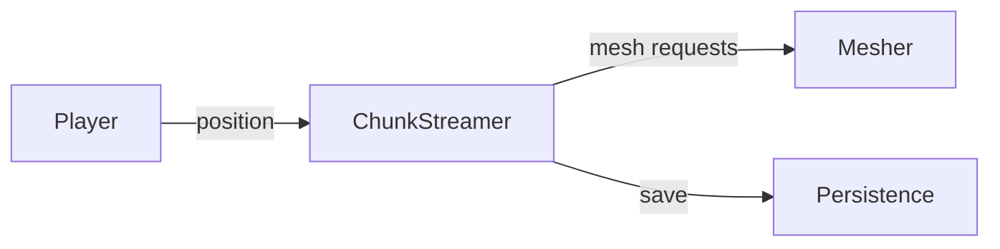
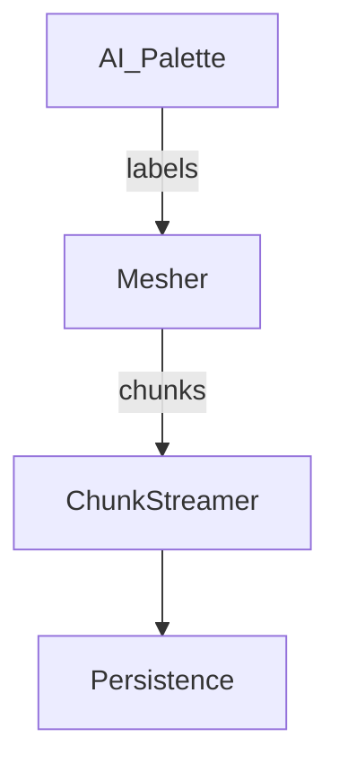

# World Architecture Overview

This guide outlines how the engine streams and persists voxel data while integrating AI palettes. It is intended for contributors exploring the world and AI subsystems.

## Chunk Streaming

`ChunkStreamer` (`src/world/chunk_streamer.cpp`) loads voxel chunks around the player asynchronously. It monitors the player position, requests new chunks, and unloads distant ones to keep memory usage stable.

## Level of Detail (LOD)

`LodComponent` (`src/world/lod_component.cpp`) selects mesh detail based on distance. Thresholds are configured in [`world_lod.cfg`](../world_lod.cfg).

## Persistence

The `Persistence` module (`src/world/persistence.cpp`) serializes chunks to disk using run-length encoding and sparse voxel octrees. Utility scripts in `src/world/persistence.py` and `src/world/rle.py` aid inspection and conversion.

## AI Palette Integration

AI palettes translate semantic labels into voxel data. The bridge lives in `src/ai/ai_palette_to_mesher.cpp`, which feeds palette output to the mesher. Configuration helpers (`src/ai/ai_palette_config_io.cpp`) load palette definitions, while the ImGui panel (`src/ai/ai_imgui_palette_panel.cpp`) lets contributors experiment at runtime.

For further exploration, see the `src/world/` and `src/ai/` directories.
